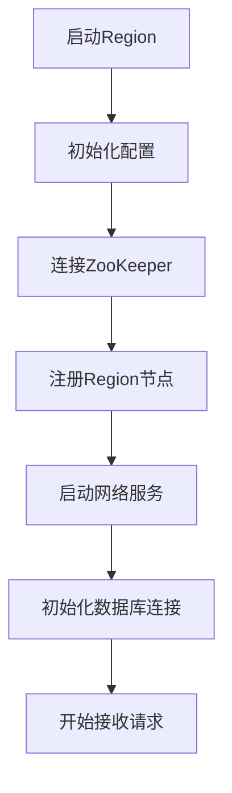

# Region 模块设计文档

## 1. 模块职责

Region 模块是分布式系统中的数据节点，负责：
- 数据存储和管理
- 与 Master 节点通信
- 处理客户端请求
- 维护 ZooKeeper 注册信息

## 2. 通信交互

### 2.1 与 Master 的交互

#### 接收指令
1. **数据迁移指令**
   - 源 Region 迁出数据请求
   - 目标 Region 接收数据请求

2. **负载均衡指令**
   - 分片迁移请求
   - 数据重分布请求

3. **配置更新指令**
   - 更新配置信息
   - 更新路由表

#### 发送信息
1. **心跳和状态报告**
   - 定期心跳
   - CPU/内存使用情况
   - 数据存储容量
   - 当前负载状况

2. **操作结果响应**
   - 数据迁移完成通知
   - 错误状态报告

### 2.2 与 ZooKeeper 的交互

#### 节点管理
- 注册临时节点（包含 Region 信息）
- 更新节点状态
- 注销节点

#### 监听事件
- Master 节点变更通知
- 配置变更通知
- 其他 Region 节点变更通知

### 2.3 与客户端的交互

#### 接收请求
- 数据查询
- 数据插入
- 数据更新
- 数据删除

#### 响应结果
- 查询结果
- 操作状态
- 错误信息

## 3. 核心处理流程

### 3.1 启动流程


### 3.2 关键功能实现

#### 数据迁移处理
- 接收迁移命令
- 导出/导入数据
- 验证数据一致性
- 报告迁移结果

#### 负载均衡
- 监控本地负载
- 执行数据重分布
- 更新路由信息

#### 错误处理
- 网络异常处理
- 数据库异常处理
- 自动恢复机制

#### 监控和报告
- 性能指标收集
- 资源使用监控
- 异常状况报告

## 4. 代码结构

### 4.1 核心类

#### Region 类
- 生命周期管理（启动/停止）
- 协调各个处理器
- 处理来自 Master 的命令
- 处理客户端请求
- 维护心跳机制

#### MasterHandler 类
- 处理与 Master 的通信
- 发送心跳和状态报告
- 接收和执行 Master 命令

#### ClientHandler 类
- 处理客户端连接
- 处理数据操作请求
- 返回操作结果

#### DBHandler 类
- 封装数据库操作
- 提供 CRUD 接口
- 管理数据库连接

#### ZookeeperHandler 类
- 管理 ZooKeeper 连接
- 处理节点注册和注销
- 监听相关事件

## 5. 配置项

### 5.1 必要配置
```properties
# Region 配置
region.id=region-1
region.host=localhost
region.port=8000

# Master 配置
master.host=localhost
master.port=9000

# ZooKeeper 配置
zk.hosts=localhost:2181
zk.timeout=3000

# 数据库配置
db.url=jdbc:mysql://localhost:3306/mds
db.username=root
db.password=password
```

## 6. 注意事项

### 6.1 性能考虑
- 使用线程池处理请求
- 合理设置缓存大小
- 优化数据库查询

### 6.2 稳定性考虑
- 添加重试机制
- 实现优雅关闭
- 做好异常处理

### 6.3 可维护性考虑
- 完善日志记录
- 添加监控指标
- 规范异常处理